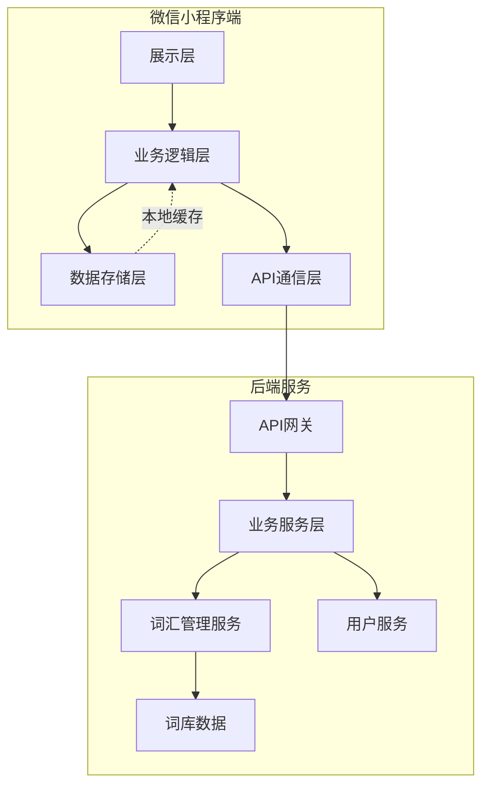
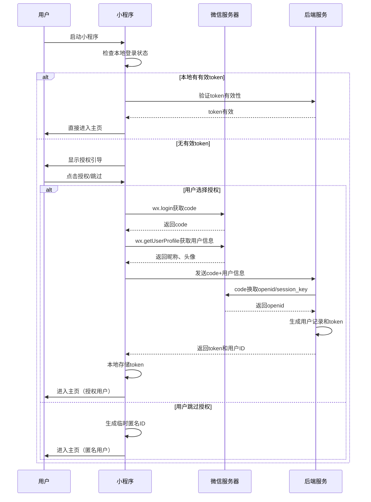
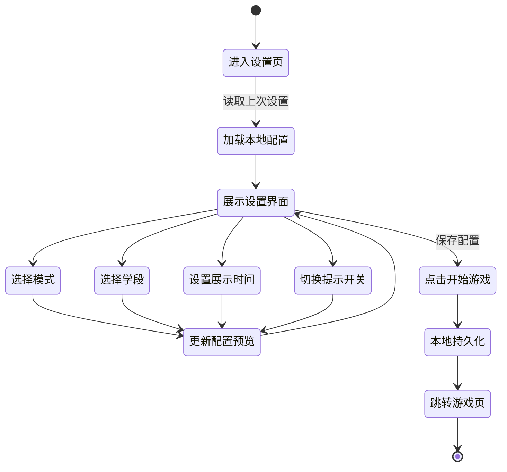
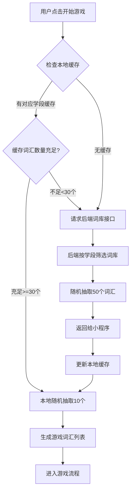
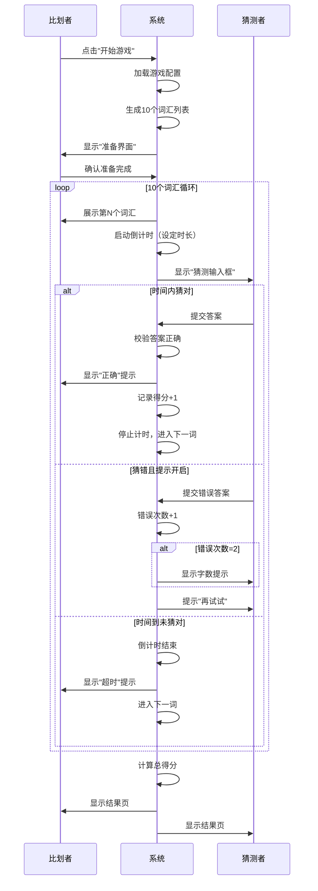
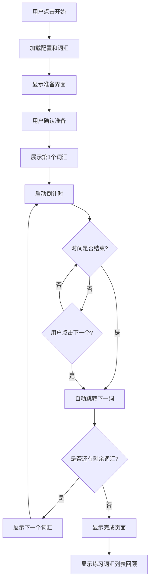
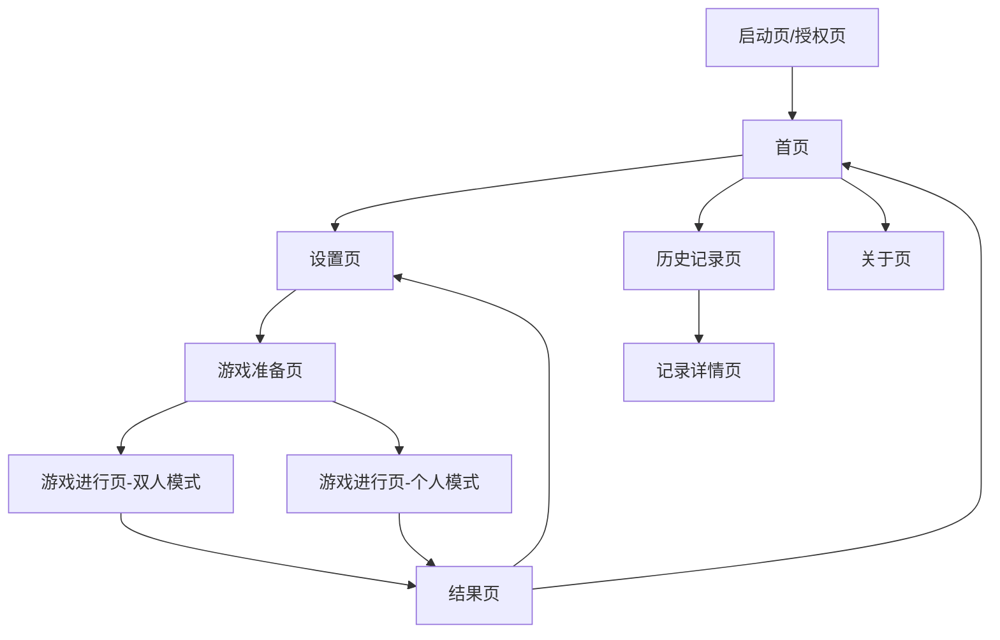

# "你比划我猜"小程序开发设计文档

## 一、项目概述

### 1.1 项目背景
基于"你比划我猜"小程序需求文档，开发一款轻量级、高灵活性的双人或单人辅助互动小程序。核心玩法为"比划传递信息+实时猜测"，通过分学段词汇库适配不同认知水平用户，支持自定义游戏参数，适用于亲子互动、同桌小游戏、家庭娱乐等场景。

### 1.2 技术选型
- **前端框架**：微信原生小程序框架
- **后端技术栈**：Go + Gin框架
- **数据存储**：本地存储（小程序端使用wx.storage）
- **词汇数据**：预置静态词库 + 云端词库（支持动态更新）

### 1.3 设计目标
- 确保低门槛、易上手的用户体验
- 实现高灵活性的参数配置能力
- 保证词汇展示的精准时间控制
- 支持离线场景下的基础游戏功能

## 二、系统架构设计

### 2.1 整体架构

### 2.2 分层架构说明

#### 2.2.1 小程序端分层
- **展示层**：页面UI组件、交互逻辑、动画效果
- **业务逻辑层**：游戏流程控制、计时器管理、数据校验
- **数据存储层**：本地配置存储、词汇缓存、游戏记录
- **API通信层**：与后端服务交互、词库同步

#### 2.2.2 后端服务分层
- **API网关**：请求路由、鉴权、限流
- **业务服务层**：核心业务逻辑处理
- **词汇管理服务**：词库CRUD、分学段筛选、批量生成
- **用户服务**：微信授权、用户信息管理

## 三、功能模块设计

### 3.1 用户授权与登录模块

#### 3.1.1 功能描述
实现微信一键授权登录，支持匿名用户使用基础功能，授权用户解锁历史记录等附加功能。

#### 3.1.2 业务流程

#### 3.1.3 数据存储设计

| 存储位置 | 数据项 | 说明 |
|---------|--------|------|
| 本地存储 | userToken | 用户登录凭证 |
| 本地存储 | userId | 用户唯一标识 |
| 本地存储 | userInfo | 昵称、头像URL |
| 本地存储 | isAuthorized | 是否已授权标识 |
| 本地存储 | loginExpireTime | 登录过期时间 |

#### 3.1.4 匿名用户功能限制

| 功能项 | 匿名用户 | 授权用户 |
|--------|----------|----------|
| 双人互动模式 | ✓ 可用 | ✓ 可用 |
| 个人练习模式 | ✓ 可用 | ✓ 可用 |
| 参数自定义设置 | ✓ 可用 | ✓ 可用 |
| 历史成绩保存 | ✗ 不可用 | ✓ 可用 |
| 自定义词库（未来功能） | ✗ 不可用 | ✓ 可用 |

### 3.2 游戏模式设置模块

#### 3.2.1 功能描述
提供游戏模式选择（双人互动/个人练习）和核心参数配置（学段、词汇数量、展示时间、提示功能）。

#### 3.2.2 参数配置表

| 参数类型 | 可选值 | 默认值 | 说明 |
|---------|--------|--------|------|
| 游戏模式 | 双人互动、个人练习 | 双人互动 | 影响游戏流程和交互方式 |
| 词汇学段 | 小学、初中、高中、大学 | 小学 | 决定词库筛选范围 |
| 词汇数量 | 10个/局 | 10 | 当前版本固定，预留扩展接口 |
| 单词展示时间 | 5秒、10秒、15秒、20秒 | 10秒 | 每个词汇的展示时长 |
| 提示功能 | 开启、关闭 | 关闭 | 开启后2次错误显示字数提示 |

#### 3.2.3 设置页面交互流程

#### 3.2.4 配置数据结构

| 字段名 | 类型 | 说明 |
|--------|------|------|
| gameMode | string | 游戏模式：dual（双人）/single（个人） |
| educationLevel | string | 学段：primary/junior/senior/university |
| wordCount | number | 词汇数量（当前固定10） |
| displayDuration | number | 展示时间（秒） |
| hintEnabled | boolean | 提示功能开关 |
| lastUpdateTime | timestamp | 配置最后更新时间 |

### 3.3 词汇管理模块

#### 3.3.1 功能描述
管理分学段词汇库，支持批量生成游戏词汇、词库同步更新、本地缓存机制。

#### 3.3.2 词汇数据结构

| 字段名 | 类型 | 说明 |
|--------|------|------|
| wordId | string | 词汇唯一标识 |
| content | string | 词汇内容 |
| educationLevel | string | 适用学段 |
| category | string | 词汇分类（动物/物品/动作/成语等） |
| difficulty | number | 难度系数（1-5） |
| charCount | number | 字数统计（用于提示功能） |
| createdAt | timestamp | 创建时间 |

#### 3.3.3 词库分类体系

| 学段 | 词汇特征 | 词汇示例 | 预估词库规模 |
|------|---------|---------|-------------|
| 小学 | 常见名词、简单动作、日常物品 | 苹果、跑步、书包 | 500+ |
| 初中 | 成语、抽象概念、学科词汇 | 守株待兔、光合作用 | 800+ |
| 高中 | 复杂成语、专业术语、文化词汇 | 望梅止渴、DNA、牛顿定律 | 1000+ |
| 大学 | 学术概念、社会现象、专业领域 | 量子纠缠、区块链、存在主义 | 1200+ |

#### 3.3.4 词汇生成策略

#### 3.3.5 词库同步机制

| 同步场景 | 触发条件 | 同步策略 |
|---------|---------|---------|
| 首次启动 | 本地无词库缓存 | 全量下载当前学段词库（50个） |
| 缓存不足 | 本地词汇<30个 | 增量补充至50个 |
| 定期更新 | 距上次更新>7天 | 检查版本号，增量更新 |
| 切换学段 | 用户切换教育阶段 | 下载新学段词库 |

### 3.4 游戏核心流程模块

#### 3.4.1 双人互动模式流程

#### 3.4.2 个人练习模式流程

#### 3.4.3 计时器设计

| 计时器类型 | 功能说明 | 实现方式 |
|-----------|---------|---------|
| 主计时器 | 控制单个词汇展示时长 | setInterval，精度100ms |
| 倒计时显示 | 实时更新剩余秒数UI | 每秒更新一次视图 |
| 暂停恢复机制 | 支持暂停游戏保留时间 | 记录暂停时刻剩余时间 |
| 超时检测 | 时间归零触发超时逻辑 | 倒计时<=0时触发事件 |

#### 3.4.4 答案校验规则

| 校验维度 | 校验规则 | 说明 |
|---------|---------|------|
| 完全匹配 | 用户输入 === 标准答案 | 区分大小写、空格 |
| 去空格匹配 | trim后完全一致 | 容错处理 |
| 同音字容错 | 特定词汇支持同音字（可选） | 未来扩展功能 |
| 英文忽略大小写 | 英文词汇不区分大小写 | 针对英语词汇 |

### 3.5 结果展示与记录模块

#### 3.5.1 结果页数据展示

| 展示项 | 数据来源 | 展示方式 |
|--------|---------|---------|
| 总得分 | 猜对词汇数量 | 大号数字突出显示 |
| 正确率 | (猜对数/总数)*100% | 百分比+进度条 |
| 用时统计 | 各词汇实际用时累加 | 总用时（秒） |
| 词汇明细 | 每个词汇的答对/超时状态 | 列表展示，标注颜色 |
| 操作按钮 | - | 再来一局、返回首页、分享成绩 |

#### 3.5.2 本地记录存储策略

| 存储内容 | 存储结构 | 存储上限 |
|---------|---------|---------|
| 游戏记录 | 数组形式存储最近N局 | 最多保留20局 |
| 单局详情 | 包含配置、得分、词汇列表 | 每局最大5KB |
| 最佳成绩 | 各学段最高分记录 | 4条记录 |

#### 3.5.3 游戏记录数据结构

| 字段名 | 类型 | 说明 |
|--------|------|------|
| recordId | string | 记录唯一标识 |
| gameMode | string | 游戏模式 |
| educationLevel | string | 词汇学段 |
| score | number | 得分 |
| accuracy | number | 正确率 |
| totalTime | number | 总用时（秒） |
| wordDetails | array | 词汇明细列表 |
| createdAt | timestamp | 游戏时间 |

词汇明细结构：

| 字段名 | 类型 | 说明 |
|--------|------|------|
| word | string | 词汇内容 |
| status | string | correct（正确）/timeout（超时）/skip（跳过） |
| usedTime | number | 该词汇用时（秒） |
| attemptCount | number | 尝试次数（双人模式） |

## 四、页面结构设计

### 4.1 页面导航结构

### 4.2 核心页面功能说明

| 页面名称 | 路径 | 核心功能 | 用户入口 |
|---------|------|---------|---------|
| 启动页 | /pages/launch/index | 授权引导、检查登录状态 | 小程序启动 |
| 首页 | /pages/home/index | 模式选择、快速开始、历史记录入口 | 授权后自动跳转 |
| 设置页 | /pages/settings/index | 游戏参数配置 | 首页点击"开始游戏" |
| 游戏准备页 | /pages/prepare/index | 角色确认、规则说明 | 设置页确认后 |
| 游戏进行页 | /pages/game/index | 词汇展示、计时、答题 | 准备页点击开始 |
| 结果页 | /pages/result/index | 成绩展示、明细查看 | 游戏结束自动跳转 |
| 历史记录页 | /pages/history/index | 历史成绩列表 | 首页点击"历史记录" |
| 记录详情页 | /pages/history/detail | 单局游戏详细数据 | 历史记录列表点击 |
| 关于页 | /pages/about/index | 小程序介绍、使用说明 | 首页点击"关于" |

### 4.3 页面交互要点

#### 4.3.1 游戏进行页（双人模式）交互设计

| 区域 | 比划者视角 | 猜测者视角 |
|------|-----------|-----------|
| 顶部 | 倒计时+当前进度（3/10） | 倒计时+当前进度（3/10） |
| 中部 | **大号显示当前词汇** | 输入框+提交按钮 |
| 底部 | 跳过按钮、暂停按钮 | 已猜错次数、提示信息 |
| 反馈 | 正确/错误/超时弹窗提示 | 正确/错误/超时弹窗提示 |

#### 4.3.2 游戏进行页（个人模式）交互设计

| 区域 | 功能说明 |
|------|---------|
| 顶部 | 倒计时+当前进度 |
| 中部 | 大号显示当前词汇 |
| 底部 | 下一个按钮、暂停按钮 |
| 反馈 | 倒计时结束自动跳转提示 |

## 五、接口设计

### 5.1 后端API接口列表

| 接口名称 | 请求方法 | 路径 | 功能说明 |
|---------|---------|------|---------|
| 微信登录 | POST | /api/auth/wechat-login | 通过code换取openid，创建用户 |
| Token验证 | POST | /api/auth/verify-token | 验证token有效性 |
| 获取词库 | GET | /api/words/list | 按学段获取词汇列表 |
| 检查词库版本 | GET | /api/words/version | 获取词库版本号 |

### 5.2 接口详细设计

#### 5.2.1 微信登录接口

**请求参数**

| 参数名 | 类型 | 必填 | 说明 |
|--------|------|------|------|
| code | string | 是 | 微信wx.login返回的code |
| nickName | string | 否 | 用户昵称 |
| avatarUrl | string | 否 | 用户头像URL |

**响应数据**

| 字段名 | 类型 | 说明 |
|--------|------|------|
| userId | string | 用户唯一标识 |
| token | string | 登录凭证 |
| expiresIn | number | token有效期（秒） |
| isNewUser | boolean | 是否为新用户 |

#### 5.2.2 获取词库接口

**请求参数**

| 参数名 | 类型 | 必填 | 说明 |
|--------|------|------|------|
| educationLevel | string | 是 | 学段：primary/junior/senior/university |
| count | number | 否 | 需要的词汇数量，默认50 |
| excludeIds | string | 否 | 排除的词汇ID列表（逗号分隔） |

**响应数据**

| 字段名 | 类型 | 说明 |
|--------|------|------|
| words | array | 词汇列表 |
| total | number | 该学段总词汇数 |
| version | string | 词库版本号 |

词汇对象结构：

| 字段名 | 类型 | 说明 |
|--------|------|------|
| wordId | string | 词汇ID |
| content | string | 词汇内容 |
| category | string | 分类 |
| charCount | number | 字数 |

### 5.3 错误码设计

| 错误码 | 说明 | 处理建议 |
|--------|------|---------|
| 10001 | 无效的code | 提示用户重新登录 |
| 10002 | token已过期 | 清除本地token，引导重新授权 |
| 10003 | token无效 | 清除本地token，引导重新授权 |
| 20001 | 词库数据不存在 | 提示用户稍后重试 |
| 20002 | 学段参数错误 | 使用默认学段 |
| 50000 | 服务器内部错误 | 提示用户稍后重试 |

## 六、数据流转设计

### 6.1 游戏完整数据流

```mermaid
flowchart LR
    A[用户进入小程序] --> B[加载本地配置]
    B --> C[检查登录状态]
    C --> D[进入首页]
    
    D --> E[用户配置参数]
    E --> F[保存配置到本地]
    
    F --> G{检查本地词库}
    G -->|充足| H[本地随机抽取]
    G -->|不足| I[请求后端词库]
    I --> J[更新本地缓存]
    J --> H
    
    H --> K[生成游戏词汇列表]
    K --> L[进入游戏页面]
    
    L --> M[游戏进行中]
    M --> N[实时记录答题数据]
    N --> O[游戏结束]
    
    O --> P[计算结果数据]
    P --> Q{用户是否授权?}
    Q -->|是| R[保存到本地记录]
    Q -->|否| S[仅展示不保存]
    
    R --> T[展示结果页]
    S --> T
```

### 6.2 本地存储数据清单

| 存储键名 | 数据类型 | 用途 | 过期策略 |
|---------|---------|------|---------|
| user_token | string | 用户登录凭证 | 30天 |
| user_info | object | 用户昵称、头像 | 永久 |
| game_config | object | 游戏参数配置 | 永久 |
| word_cache_primary | array | 小学词库缓存 | 7天 |
| word_cache_junior | array | 初中词库缓存 | 7天 |
| word_cache_senior | array | 高中词库缓存 | 7天 |
| word_cache_university | array | 大学词库缓存 | 7天 |
| game_records | array | 游戏历史记录 | 永久（最多20条） |
| best_scores | object | 各学段最佳成绩 | 永久 |

## 七、性能与优化设计

### 7.1 性能指标要求

| 指标项 | 目标值 | 说明 |
|--------|--------|------|
| 小程序包体积 | <2MB | 确保快速加载 |
| 首页加载时间 | <1.5秒 | 从启动到首页可交互 |
| 词汇切换响应 | <100ms | 点击下一个到词汇显示 |
| 计时器精度误差 | ±50ms | 确保公平性 |
| 接口响应时间 | <500ms | 后端API平均响应时间 |

### 7.2 优化策略

#### 7.2.1 小程序端优化

| 优化项 | 策略 |
|--------|------|
| 分包加载 | 将历史记录、关于页面等非核心功能分包 |
| 图片优化 | 使用WebP格式，图片懒加载 |
| 词库预加载 | 启动时后台预加载常用学段词库 |
| 节流防抖 | 答题提交按钮防重复点击 |
| 虚拟列表 | 历史记录长列表采用虚拟滚动 |

#### 7.2.2 后端优化

| 优化项 | 策略 |
|--------|------|
| 词库缓存 | 使用内存缓存（如Redis）存储热门学段词库 |
| 数据预处理 | 词库数据提前分学段索引 |
| 接口限流 | 防止恶意请求，保护服务稳定性 |
| CDN加速 | 词库数据通过CDN分发 |

### 7.3 兜底策略

| 异常场景 | 兜底方案 |
|---------|---------|
| 网络请求失败 | 使用本地缓存词库，提示离线模式 |
| 词库为空 | 内置基础词库（每学段20个） |
| 计时器异常 | 检测到计时停滞自动重置 |
| 存储空间不足 | 清理最早的游戏记录 |

## 八、安全与合规设计

### 8.1 数据安全

| 安全维度 | 设计方案 |
|---------|---------|
| 通信加密 | 所有API接口使用HTTPS |
| Token安全 | JWT方式，设置合理过期时间 |
| 敏感信息 | 不存储用户隐私敏感数据 |
| 防重放攻击 | 接口添加时间戳和签名校验 |

### 8.2 小程序合规

| 合规项 | 要求 |
|--------|------|
| 隐私政策 | 首次启动展示隐私政策 |
| 授权说明 | 明确告知用户授权用途 |
| 数据最小化 | 仅收集必要的用户信息 |
| 用户权益 | 支持用户撤销授权 |

## 九、版本规划

### 9.1 V1.0 MVP版本（当前设计范围）

| 功能模块 | 功能点 |
|---------|--------|
| 用户系统 | 微信授权登录、匿名模式 |
| 游戏模式 | 双人互动、个人练习 |
| 参数设置 | 学段选择、时间设置、提示开关 |
| 词库管理 | 四个学段预置词库、本地缓存 |
| 游戏流程 | 10个词汇/局、计时器、答案校验 |
| 结果展示 | 得分统计、词汇明细 |
| 本地记录 | 最近20局记录、最佳成绩 |

### 9.2 未来版本规划方向

| 版本 | 计划功能 |
|------|---------|
| V1.1 | 自定义词汇数量、分享成绩卡片 |
| V1.2 | 用户自定义词库、云端同步记录 |
| V1.3 | 排行榜功能、多人联机模式 |
| V2.0 | 语音识别猜词、AI智能出题 |

## 十、技术实现关键点

### 10.1 计时器实现要点

- 使用小程序setInterval实现精确计时
- 考虑页面切换到后台的计时暂停处理
- 倒计时归零时立即触发超时逻辑
- 支持暂停和恢复功能

### 10.2 词汇随机抽取算法

- 使用Fisher-Yates洗牌算法确保随机性
- 同一局游戏内词汇不重复
- 支持排除已出现词汇ID
- 保证各分类词汇分布均衡

### 10.3 答案校验逻辑

- 去除首尾空格后进行比对
- 支持中文、英文、数字混合词汇
- 未来扩展支持同义词、同音字容错

### 10.4 本地存储管理

- 定期清理过期缓存
- 存储空间不足时自动清理旧记录
- 关键数据使用JSON序列化存储
- 读取时做异常处理和默认值兜底

## 十一、开发交付物

### 11.1 小程序端交付物

| 交付物 | 说明 |
|--------|------|
| 页面文件 | 包含wxml/wxss/js/json的完整页面 |
| 组件库 | 倒计时组件、词汇卡片组件等复用组件 |
| 工具类 | 存储管理、API封装、工具函数库 |
| 配置文件 | app.json、project.config.json |
| 静态资源 | 图标、背景图等资源文件 |

### 11.2 后端服务交付物

| 交付物 | 说明 |
|--------|------|
| API服务 | Go语言编写的RESTful API服务 |
| 词库数据 | 各学段词汇JSON数据文件 |
| 部署文档 | 服务器部署、环境配置说明 |
| 接口文档 | API接口详细说明文档 |

### 11.3 测试交付物

| 交付物 | 说明 |
|--------|------|
| 测试用例 | 功能测试、兼容性测试用例 |
| 测试报告 | 测试结果和问题汇总 |

## 十二、开发时间规划建议

| 阶段 | 工作内容 | 建议周期 |
|------|---------|---------|
| 需求细化 | 与产品确认交互细节、设计评审 | 2天 |
| 后端开发 | Go服务搭建、API开发、词库准备 | 5天 |
| 前端开发 | 页面开发、组件封装、功能联调 | 8天 |
| 联调测试 | 前后端联调、功能测试、兼容性测试 | 3天 |
| 优化发布 | 性能优化、Bug修复、提交审核 | 2天 |

总计：约20个工作日（4周）
